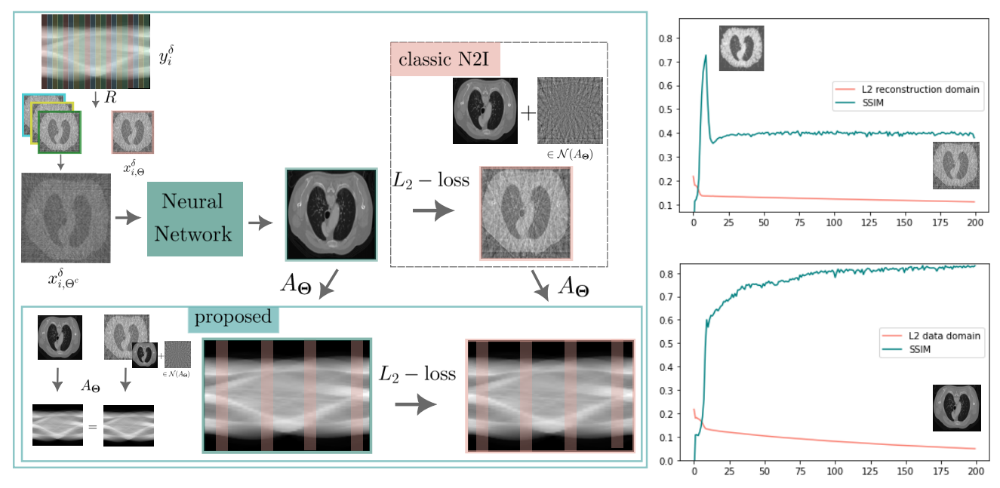

### Description
This is a Github repository for self-supervised image reconstruction for sparse view CT data. It uses a similar strategy as Noise2Inverse, but is particularly suited for very sparsely sampled data, as it automatically removes artifacts.

### Installation
We have included the .yml file which we have used. We have used pytorch with cuda 11.7. and for the differentiable FBP we used tomosipo (https://github.com/ahendriksen/tomosipo). For the CT geometry, we installed LION (https://github.com/CambridgeCIA/LION).
